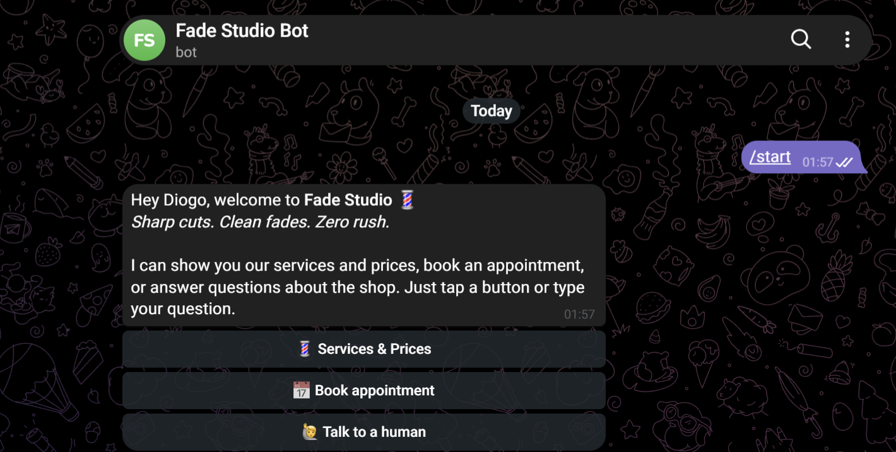
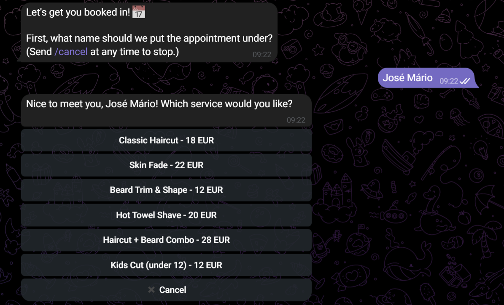
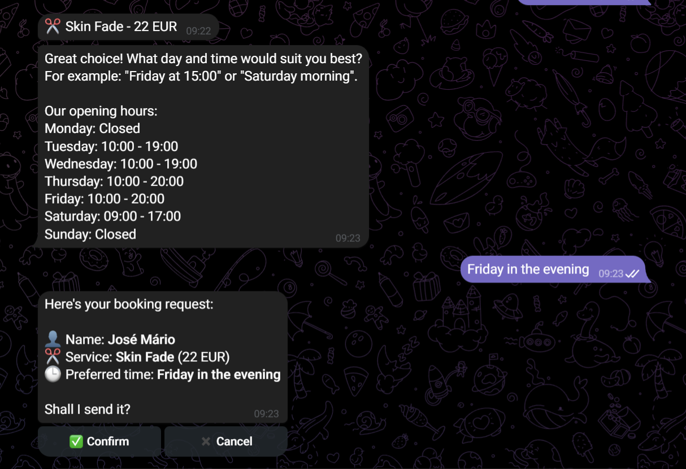
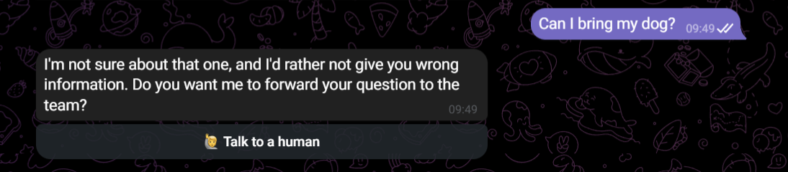

# 💈 Fade Studio – Telegram Support Bot

A Telegram customer support assistant for **Fade Studio**, a (fictional) barbershop. It answers customer questions with Google Gemini, takes booking requests, and hands conversations to a human when it can't help.

All answers come from a single `business_info.json` file. The AI is told not to make up prices, hours or policies: when the answer isn't in the file, it says so and offers to forward the question to the team.

---

## ✨ Features

- **Welcome menu**: `/start` greets the customer with three buttons: *Services & Prices*, *Book appointment*, *Talk to a human*.
- **AI answers from your data**: free-text questions ("Are you open Saturday?", "How much is a skin fade?") are answered by Gemini, using only `business_info.json`. The bot replies in the customer's language.
- **No made-up answers**: if the answer isn't in the business info, the model returns a handoff signal and the bot offers to forward the question to a person instead of guessing.
- **Booking flow**: a guided conversation (name → service picked from buttons → preferred day/time → confirm). Requests are saved to `bookings.json` with a reference number.
- **Human handoff**: every handoff request is logged to `handoffs.json`, including the question the AI couldn't answer.
- **Staff notifications** (optional): new bookings and handoff requests can be sent to a Telegram chat or staff group.
- **Services & prices from the file**: the price list and opening hours are rendered straight from the JSON, without the AI, so they are always exact.
- **Production details**: async throughout, atomic JSON writes, input validation, error handling, the bot's command menu set on startup, and secrets kept in `.env`.

## 🖼️ Screenshots

| Welcome menu | Services & Prices | AI answer | Booking flow | Human handoff |
|:---:|:---:|:---:|:---:|:---:|
|  |  |  |  |  |

## 🧱 Tech stack

- Python 3.10+
- [python-telegram-bot](https://python-telegram-bot.org/) v21+ (async)
- [Google Gen AI SDK](https://ai.google.dev/gemini-api/docs) (`google-genai`) – Gemini
- `python-dotenv` for configuration

## 📁 Project structure

```
fade-studio-bot/
├── bot/
│   ├── main.py            # Entry point: builds the app and registers handlers
│   ├── config.py          # Environment settings and file paths
│   ├── ai.py              # Gemini client, system prompt and handoff detection
│   ├── business.py        # Loads business_info.json and formats it
│   ├── keyboards.py       # Inline keyboards and callback IDs
│   ├── storage.py         # Async, atomic JSON stores (bookings, handoffs)
│   └── handlers/
│       ├── general.py     # /start, menu, AI answers, human handoff
│       └── booking.py     # Booking conversation
├── data/
│   ├── business_info.json # Hours, prices, services, address, policies, FAQ
│   ├── bookings.json      # Created at runtime (git-ignored)
│   └── handoffs.json      # Created at runtime (git-ignored)
├── docs/screenshots/
├── .env.example
├── requirements.txt
└── README.md
```

## 🚀 Setup

### 1. Get your keys

- **Telegram token**: talk to [@BotFather](https://t.me/BotFather), send `/newbot` and copy the token.
- **Gemini API key**: create one at [Google AI Studio](https://aistudio.google.com/apikey).

### 2. Install

```bash
git clone <your-repo-url> fade-studio-bot
cd fade-studio-bot

python -m venv .venv
# Windows
.venv\Scripts\activate
# macOS / Linux
source .venv/bin/activate

pip install -r requirements.txt
```

### 3. Configure

```bash
cp .env.example .env     # Windows: copy .env.example .env
```

Then edit `.env`:

| Variable | Required | Description |
|---|:---:|---|
| `TELEGRAM_TOKEN` | ✅ | Bot token from @BotFather |
| `GEMINI_API_KEY` | ✅ | Gemini API key |
| `GEMINI_MODEL` | | Model name, default `gemini-3.1-flash-lite` |
| `ADMIN_CHAT_ID` | | Chat that receives booking and handoff notifications. To find your ID, message [@userinfobot](https://t.me/userinfobot). |

> **Note:** free-tier Gemini keys have low rate limits (a few requests per minute per model). The bot retries temporary errors automatically, and when Gemini is unavailable it tells the customer and offers a human. For real traffic, enable billing on the key.

### 4. Run

```bash
python -m bot.main
```

Open your bot in Telegram and send `/start`.

## 💬 Commands

| Command | What it does |
|---|---|
| `/start` | Welcome message and main menu |
| `/services` | Services, prices and opening hours |
| `/book` | Start a booking request |
| `/human` | Ask for a member of the team |
| `/cancel` | Cancel the booking in progress |
| `/help` | List of commands |

Any other text message is answered by the AI assistant.

## 🛠️ Customizing for another business

Everything business-specific is in **`data/business_info.json`**: name, address, contacts, opening hours, services (with `id`, `name`, `price`, `duration_min`, `description`), policies and FAQ. Edit it and restart the bot. The AI context, the price list and the booking buttons all update automatically.

## 🗂️ Data format

**`bookings.json`**

```json
{
  "id": "A1B2C3D4",
  "created_at": "2026-10-01T14:32:10+00:00",
  "telegram_user_id": 123456789,
  "telegram_username": "joao",
  "name": "João Silva",
  "service_id": "skin_fade",
  "service_name": "Skin Fade",
  "price": 22,
  "preferred_time": "Friday at 15:00",
  "status": "pending"
}
```

**`handoffs.json`**

```json
{
  "id": "E5F6A7B8",
  "created_at": "2026-10-01T14:40:02+00:00",
  "telegram_user_id": 123456789,
  "telegram_username": "joao",
  "customer_name": "João Silva",
  "reason": "ai_could_not_answer",
  "question": "Can I bring my dog?",
  "status": "open"
}
```

## 🔒 Security notes

- `.env` is git-ignored. Never commit real keys.
- `bookings.json` and `handoffs.json` contain customer data and are git-ignored too.
- User input is HTML-escaped before it's shown in formatted messages.

## 🧭 Possible next steps

- Store data in SQLite or PostgreSQL instead of JSON files
- Check real availability with Google Calendar
- Send appointment reminders with the PTB `JobQueue`
- Let staff reply to customers from inside the bot
